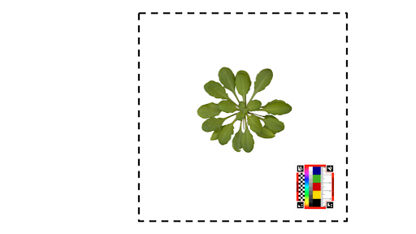
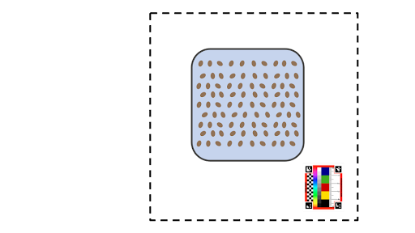
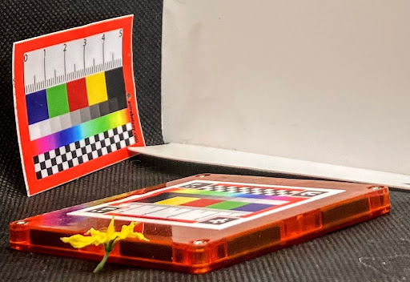
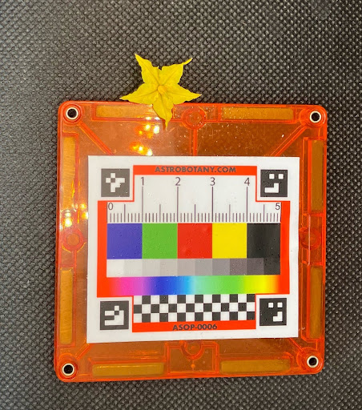
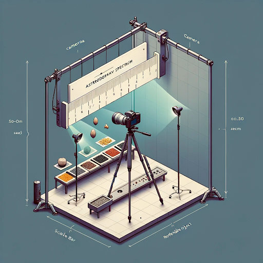

# AstroBiology_Photography
AstroBiology Photography Training Guide for Transforming to Open Science and Growing Beyond Earth

AstroBotany Scientific Photography SOP Standard Operating Procedure v1

Authors: Richard Barker, Lucas Bauer, C.M. Johnson and Simon Gilroy
01/01/2025

---

**Introduction**

This report introduces ways to optimize your research on spaceflight-exposed seeds by:
Designing a photography training plan for scientists to improve image consistency and data quality.
Enhancing the performance of the "AstroBotany Spectrum" scale bar through calibration, positioning, and digital enhancements.
Crafting a simple two-stage survey to assess the educational impact of the training program and inform future iterations. 
Our combined efforts aim to equip your research team with the tools and knowledge to capture high-quality images and analyze the effects of spaceflight on seeds with greater accuracy and clarity. 

This introduction summarizes the key points that this document will cover and highlights the collaborative nature of our discussion towards a shared goal. 
Feel free to adapt it further to fit your specific needs!

# AstroBotany Spectrum Scale Imaging Setup Diagram 

**Above:** Illustration the optimal placement of a camera, the AstroBotany Spectrum scale bar, lights, and camera for consistent and high-quality image capture. 
A simple diagram showing the placement of the camera is a light perpendicular to the germinating seeds or seedlings. In this example, the seeds are germinated on agar gel / or blue filter paper.

**Key Components to consider:**

**Camera mount:** Positioned perpendicular to the imaging plane, ensuring a straight-on view of the seeds and scale bar.
**Spectrum Scale Bar**: Place object of know size and/or colour directly within the same plane as the seeds, preferably slightly behind or beside them for clear visibility.
**Lights:** It's useful to have two adjustable light sources positioned at 45-degree angles to the imaging plane to creating even indirect illumination to help minimizing shadows. 
Diffusers can be used to soften the light further or circular flash bulbs can also provide even illumination. Play around with the resources you have and see what works best for your specific goal. 

---

Start with a single plant and ask yourself if you took a photo from that angle do you think you could easily draw a line around the edge?

**Additional Tips:**
Use a contrasting, non-reflective background (e.g., black felt or card) to enhance the visibility of both seeds and the scale bar.
Maintain a consistent camera-to-subject distance for all image captures. A sample holder that remains set distance from the camera stand would be sufficient.
Employ a stable tripod or stand to avoid camera shake and blurry images. 
Consider including a reference object of known size (e.g., ruler, AstroBotany SPECTRUM sticker) in addition to the scale bar for further size verification.
Capture images in RAW format for maximum post-processing flexibility.

DNG: Adobe's Digital Negative format is the only standardized raw format. It is developed on the TIFF 6.0 format.
KDC: Kodak's format
CRW CR2: Canon's format
ERF: Epson's format
NEF NRW: Nikon's format
ORF: Olympus's format
RW2: Panasonic's format
ARW, SRF, SR2: Sony's format

**.TIF files are often used for color analysis and .JPEG are compressed but can be used for morphology analysis.**

Remember to adjust the specific setup based on your camera's field of view, working distance, and desired image magnification.

---

# Setting Up Your Photos to Maximize Analysis Potential

It is critical to take photos which are clear both for human eyes and for computer interpretation. 
Taking photos can be simple, especially when using modern tools which allow for the automatic standardization of images, making your images comparable to the images of researchers around the globe.

Here are some simple tips for taking the best possible images:

**Contrast:** Place the plant you are imaging on a plain, consistent background which contrasts with the plant. A clean black or white (Black is usually best but there are exceptions where white is best) felt background is a great option.

**Lighting:** Consider the lighting direction and intensity on the subject. Minimize glare or reflection of light. Consistent lighting is key for comparable imagery. Color or tone of lighting is another consideration. Plants imaged in blue or red light will not be easily compared to those taken under bright white.

**Composition:** Place your plant close to the center of the image and make sure no other plants or objects overlap with it. This allows a computer to easily take measurements of your plant without interference from other tissues. Place an AstroBotany Spectrum Standard or other size and color marker in the corner of your imaging area to maximize your ability to measure the plant.

**Consistency:** Plan ahead to make sure each of your images follows a pattern. Ideally, image composition (i.e., position of plant, orientation etc.) should look very similar to one another, except for different plants being pictured. This includes clear, even lighting of what is being imaged. Consistent images make it easier for both humans and computers to quickly and accurately measure your plants.
Following these guidelines will ensure your images are not only clear and informative for you, but allow your colleagues and scientists worldwide to use your images.

**Arabidopsis Seeds on a Surface or on  a Petri Plate**
Diagrams for Setting Up your Photos
These diagrams show ideal photo setups for maximizing the ease of analyzing your photos. 
The dashed line shows the area you want to capture in your images. 
While these images show a white background, a black background would also work.

# Example photography setup for tomato flower

**Note:** Here the SPECTRUM sticker is mounted to a plastic tile to make it flat, in the background you can see an older version of the sticker standing up and curving as it’s not stuck to a surface.

An example photographic result from above that makes it easier to segment this tomato flower using computer vision code.

---

# Advice and tools to enhance the performance of the 
“AstroBotany Spectrum”: https://astrobotany.com/product/airi-bio-imaging-spectrum-5cm/

**1. Calibration and Validation:** 
AstroBotany Spectrum Standard checks: Periodically verify the scale bar's accuracy using certified color calibration standards, such as rulers or color gauge blocks.
Image analysis software: Utilize software that can automatically detect and measure the scale bar in images, ensuring consistent readings.
ImageJ, MatLab and Google collab notebooks also provide many methods for analysis and deep learning. 
Examples of code on Github such as SOAPP and PlantCV: Github is a website where people share computer code (https://github.com/lvbauer/web-glyphics). 
This example custom code was written in python and R can be used to help automate image analysis. 
SOAPP is a software tool designed to be used along with the AstroBotany spectrum stickers to assist with image analysis. It is built using the Plant Computer Vision known as PlantCV (https://plantcv.readthedocs.io/en/stable/).  
Try out this demo web application: It can assist with image analysis and SPECTRUM identification.  “ https://web-glyphics.streamlit.app/ ”
Metadata and calibration record: The data that describes the image you have captured (its metadata) are as important as the image itself. Without this data, future researchers, and probably even you in just a few days, will be unable to work out what the image is of and how it was analyzed. Maintain a detailed log of calibration dates, results, and any adjustments made to the scale or environment.

**2. Positioning and Placement:** 
Direct inclusion of AstroBotany Spectrum (or other scale bar): Place the scale bar within the same imaging plane as the seeds/roots/seedlings/leaves or whatever stage of development is being analysed for accurate size correlation. 
Avoid placing it at peculiar angles relative to the organ or tissue of interest. 
Clear visibility: Ensure the scale bar is well-lit and visible in all images. Use a contrasting colour such Blue cardboard for germinating seeds or Black felt backdrops for larger material if necessary.
Multiple angles: Consider capturing images from multiple angles with the scale bar in different orientations for comprehensive measurements. Orthographic projections are usually the easiest to analyze. 

**3. Lighting and Contrast:**
Optimal illumination: Adjust lighting angles to minimize glare and shadows that could obscure the scale bar's markings.
Direct lighting: LED White light halo provides optimal even illumination and smartphone flashes can also be very effective 
Backlighting can make useful silhouettes: If possible, employ backlighting techniques to create a clear silhouette of the scale bar against the seeds.

**4. Digital Enhancement:**
Image processing software: Use software tools to adjust contrast, brightness, and sharpness to enhance the visibility of the scale bar.
ImageJ also known as Fiji is a biomedical image image analysis tool that is often used to measure images (https://imagej.net/software/fiji/). 
Github is a website that scientists use to share code. Tools like SOAPP is being developed as a student-friendly application with a Graphical User Interface (GUI) designed to help image analysis. More information coming soon.
Edge detection: Employ edge detection filters to create a more defined outline of the scale bar, especially for fine markings.

**5. Data Integration:**
Software compatibility: Ensure the scale bar's measurements can be seamlessly integrated with your image analysis software.
Metadata inclusion: Store scale bar information (e.g., length, units) as metadata within image files for easy retrieval and analysis.
Data sharing: There are many ways to share images such as Google Drive links, Zendo and others.  

---
**Additional Tips:**

**Training and guidance:** Provide clear instructions and training to scientists on the proper use and placement of the scale bar.
**Feedback mechanism:** Encourage feedback on the scale bar's performance to identify potential issues and opportunities for improvement.
**Regular maintenance:** Clean and inspect the scale bar regularly for any signs of wear or damage that could affect accuracy.

For further analysis consider these tools and concepts:

**Specialized software:** Explore software programs specifically designed for scientific image analysis with scale bars.
**Digital overlays:** Investigate options for digital scale bar overlays that can be added to images during post-processing.
**3D imaging techniques:** For complex structures, consider 3D imaging techniques that can capture scale information in multiple dimensions.

By implementing these strategies and utilizing appropriate tools, you can maximize the accuracy and effectiveness of the AstroBotany Spectrum scale bar. 

**DALLE4 inspiration:** View of the experiment with an additional feature: the plants are now inside cuboid tissue culture tubes. These tubes are placed within the microwave, containing aquatic plants at various stages of growth. Above the microwave, the CCTV cameras observe plant growth, and a cellphone-style touch screen on a stand, all focusing on the plants inside the tubes and bowls. This arrangement highlights a more controlled and scientific approach to plant growth monitoring in a high-tech experimental environment.

---

# 5 Simple Questions for Assessing Education Impact 
(2-Stage Survey guide for teacher)
Additional preparation stage for educators 

The group lead should go to Google Forms and create a brief survey (Using Google or some other surveying software https://www.google.com/forms/)

**Stage 1:** Before Class (5-10 minutes before the first session)

**Confidence Score:** On a scale of 1 (not confident at all) to 5 (extremely confident), how confident are you in your current understanding of biological photography?
**Prior Knowledge:** Briefly describe your existing knowledge or experience with biological photography.
**Learning Goals:** What are your top 3 goals for learning in this course?
**When is a good time to photograph seedlings and why? discuss and write notes...**
**What angles to use while photography different plant organs to improve morphometric analysis? discuss and write notes...**
**How best to illuminate samples to enhance subsequent spectral analysis? discuss and write notes...**

**Stage 2:** After Class (5-10 minutes after the last session)
**Confidence Score Revisited:** On a scale of 1 to 5, how confident are you now in your understanding of Space Biology Photography]?
**Impact Assessment:** Briefly describe how planning and implementing morphometric photography impacted your understanding of space biological photography analysis.

---

**Survey Administration:**
Before Class: Use a digital survey platform (e.g., Google Forms, SurveyMonkey) or distribute paper copies. Remind students to complete the survey before the first session begins.
After Class: Distribute the same survey again immediately after the final session. Please encourage students to answer honestly and reflect on their learning experiences.

**Data Analysis:**
After this project-based learning program is complete you should compare pre- and post-course confidence scores to assess overall knowledge gain.
Analyze students' self-reported prior knowledge and learning goals to understand their initial motivations and expectations.
Use qualitative responses to the "Impact Assessment" question to identify specific learning activities that were most effective and areas for improvement in future iterations of the course.

**Additional Tips:**
Offer anonymity for honest responses.
Share anonymized survey results with students to demonstrate the impact of the course and encourage continued learning.

Conclusion: This simple two-stage survey provides valuable insights into the effectiveness of your education program and helps you tailor future iterations to best meet the needs of your learners. 
Collective sharing results from potential surveys may allow for increased impact by generating positive feedback loops….

---

**DALLE4 inspiration:** Imagine a 3D holographic screen that displays images of the plants' health, visualized in a hologram that ranges from red to blue, indicating various health levels. The screen is positioned near a microwave and cameras. The hologram floats in the air, providing a dynamic and interactive way to monitor plant health. This addition helps you imagine how you could bring high-tech and advanced technology to the experimental setup, to emphasize the cutting-edge nature of your research.

**A few additional points for educators** 
This biological photography training plan aims to be comprehensive and cover all the key aspects for improving data consistency. However, there are a few additional points you might consider including or discussing with your team:

**1. Image Composition and Storytelling:**
Visual hierarchy: Train scientists on composing images that guide the viewer's eye to the main point of interest using techniques like depth of field, leading lines, and rule of thirds.
Storytelling with images: Go beyond just capturing data and encourage scientists to think about the narrative their images tell. This can be particularly impactful for presentations and outreach materials.

**2. Advanced Techniques:**
Focus stacking: For capturing highly detailed macro images of seeds, train scientists on focus stacking techniques to overcome depth-of-field limitations.
Light painting: Introduce light painting techniques for highlighting specific features of seeds or creating visually compelling images for presentations.
Time-lapse photography: For studying dynamic processes like seed germination or seedling growth, consider including time-lapse photography techniques in the training.
AI-assisted companion planting: Large language models such as GRN.AI3 can be used to generate experimental models designed to optimise “small space” garden planning  https://huggingface.co/spaces/danidanidani/GRDN.AI.3

**3. General Software Skills:**
Image editing software: Train scientists on basic image editing skills in software like google photos, Adobe Lightroom or Photoshop to adjust brightness, contrast, and color without compromising data integrity.
Other Image Analysis Software: Introduce specific software tools designed for scientific image analysis, such as measuring distances, areas, and other parameters from captured images.

**4. Ethics and Data Sharing:**
Image ownership and authorship: Discuss ethical considerations around image ownership and proper attribution in scientific publications.
Data sharing practices: Train scientists on best practices for sharing and archiving raw and processed image data to ensure transparency and reproducibility.
NASA Transform to Open Science (TOpS): More training and awards from NASA can be achieved by completing the free online TOpS training course. https://nasa.github.io/Transform-to-Open-Science/

---

By incorporating these additional elements, you can create a more well-rounded biological photography training program that empowers scientists to not only capture high-quality data but also effectively communicate their findings to a wider audience.

Remember, the specific needs of your research team and the complexity of the biological systems you're studying will ultimately determine the ideal training content. 
Feel free to tailor these suggestions to suit your specific requirements!
I hope this feedback is helpful!

DALLE 4 inspiration: Minimal diagram of an AstroBotany Spectrum Scale Imaging Setup. The setup includes a camera positioned perpendicular to the imaging plane for a straight-on view of the seeds and the scale bar. An AstroBotany Spectrum Scale Bar is placed within the same plane as the seeds, slightly behind or beside them for visibility. Two adjustable light sources are placed at 45-degree angles to the imaging plane, ensuring even illumination. A contrasting background enhances seed and scale bar visibility. The setup also includes a stable tripod and a reference object for size verification. 

More information on preparing Arabidopsis and microgreens as samples for photography using spaceflight tested methodology can be found at https://astrobotany.com/standard-preparation-arabidopsis-thaliana-spaceflight-experiment/

Procedure 6.0: 
Prepare “space media” gel agar plates per ASOP-0003: Making Space Media.
Sterilize on-test A. thaliana seeds using ASOP-0001: Ethanol Seed Sterilization or ASOP-0002: Vapor Phase Seed Sterilization depending on assay requirements.  
Sow the sterilized on-test A. thaliana samples onto the space media plates using the instructions in ASOP-0008: Sowing Tiny Seeds on Media.
The A. thaliana seeds should now be kept dormant until they are deliberately exposed to light again at the experiment start in a spaceflight or class room environment.

